# Proyecto 1 — Primer avance: Requisitos del cliente detallados

## 1. Sistema real e integrantes

- **Caso:** Caso 2 — E-commerce / Retail (A)
- **Sistema real elegido:** Advantage Online Shopping (Parasoft) — https://www.advantageonlineshopping.com/
- **Integrantes:** Maykol Morales, Sebastián Urbina
- **Formato de requisitos usado en todo el documento:** RF (Requisito funcional)

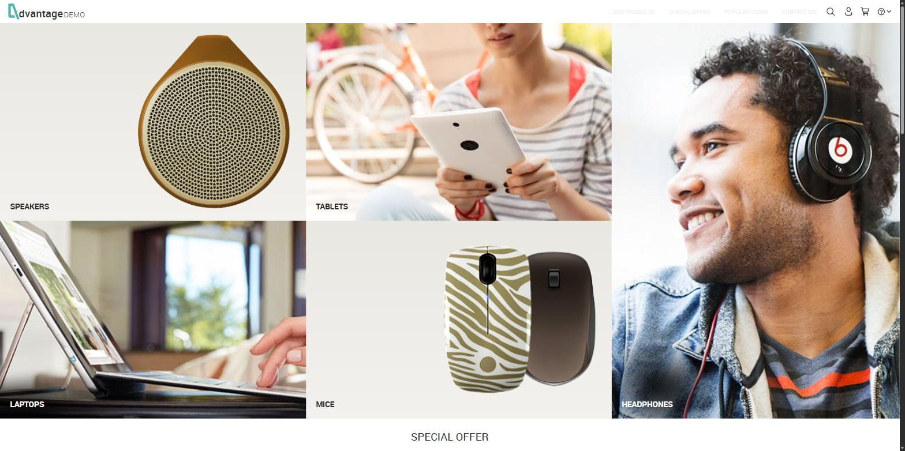

---

## 2. Tabla de funcionalidades identificadas

| # | Funcionalidad | Dónde se encuentra en el sistema real (pantalla/URL) |
|---|---|---|
| 1 | Registro y login de usuarios | Registro: `#/register` ("CREATE ACCOUNT"). Login: modal accesible desde el ícono de cuenta en cualquier pantalla (`#/`), o pantalla dedicada `#/login` que aparece automáticamente al intentar pagar sin sesión iniciada. |
| 2 | Navegación y búsqueda de productos por categoría | Navegación: `#/category/{Categoria}/{id}` (ej. `#/category/Speakers/4`), accesible desde los banners del home. Búsqueda: campo con autocompletado en la barra superior; resultados completos en `#/search/?viewAll={término}`. |
| 3 | Carrito de compras | Mini-carrito desplegable (ícono de carrito, cualquier pantalla) y página completa `#/shoppingCart`. |
| 4 | Aplicación de tarjetas de regalo / promociones | **No disponible en el sistema real** (ver hallazgo en sección 8). |
| 5 | Checkout con dirección de envío y método de pago | `#/orderPayment` — Paso 1 "Shipping details", Paso 2 "Payment method" (SafePay o MasterCard). |
| 6 | Lista de deseos (wishlist) | **No disponible en el sistema real** (ver hallazgo en sección 9). |
| 7 | Historial de pedidos | `#/MyOrders` (menú de cuenta → "My orders"). |

---

## 3. Funcionalidad: Registro y login de usuarios

**Dónde se encuentra:** `#/register` (registro) y modal de login en `#/` / pantalla `#/login` (login).

| Formulario de registro (RF-01, RF-03) | Error de validación de username (RF-02) | Error de login (RF-05) |
|---|---|---|
| 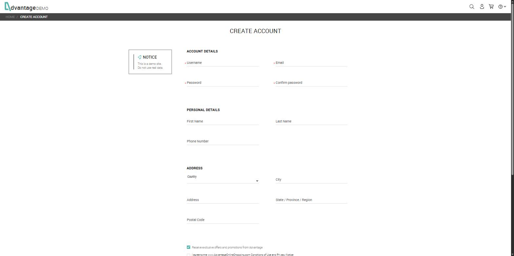 | 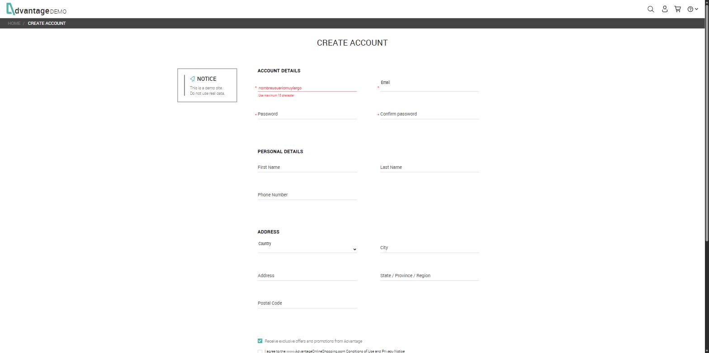 | 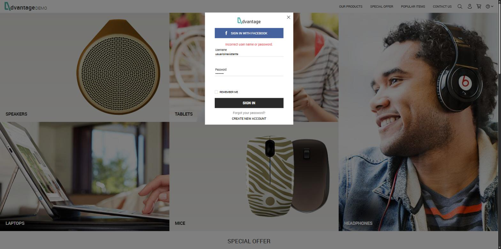 |

| ID | Requisito verificable | Actor | Datos y reglas | Resultado esperado | Prioridad |
|---|---|---|---|---|---|
| RF-01 | El sistema debe registrar una cuenta nueva cuando el username, email, password y confirmación de password son válidos y se aceptan las condiciones de uso. | Visitante no registrado | Username, Email, Password y Confirm password son obligatorios (marcados con asterisco); Password y Confirm password deben coincidir; checkbox "I agree to the Conditions of Use and Privacy Notice" obligatorio. First Name, Last Name, Phone Number, Country, City, Address, State y Postal Code son opcionales. | La cuenta se crea, el usuario queda autenticado automáticamente (su username aparece en la barra superior) y puede acceder a checkout, "My orders" y "My account". | Alta |
| RF-02 | El sistema debe rechazar el registro cuando el username excede el máximo de 15 caracteres. | Visitante no registrado | Probar username de 16+ caracteres (inválido) vs. username de 15 caracteres o menos (válido), con el resto de campos obligatorios completos. | La cuenta no se crea y se muestra el mensaje "Use maximum 15 character" debajo del campo Username. | Alta |
| RF-03 | El sistema debe impedir el envío del formulario de registro mientras no se acepten las condiciones de uso. | Visitante no registrado | Todos los campos obligatorios completos y válidos, pero el checkbox "I agree to the Conditions of Use and Privacy Notice" sin marcar. | El botón REGISTER permanece deshabilitado y el formulario no puede enviarse. | Media |
| RF-04 | El sistema debe autenticar al usuario cuando ingresa un username y password correctos de una cuenta existente. | Usuario registrado | Username y password válidos y coincidentes con una cuenta existente. | El usuario queda autenticado, su username se muestra en la barra superior y accede a las funciones que requieren sesión (checkout, "My orders", "My account"). | Alta |
| RF-05 | El sistema debe rechazar el inicio de sesión cuando el username no existe o el password es incorrecto. | Visitante / usuario no autenticado | Probar username inexistente, y por separado password incorrecto para una cuenta existente. | El sistema no autentica al usuario y muestra el mensaje "Incorrect user name or password." | Alta |

---

## 4. Funcionalidad: Navegación y búsqueda de productos por categoría

**Dónde se encuentra:** banners de categoría en el home → `#/category/{Categoria}/{id}`; buscador con autocompletado en la barra superior → `#/search/?viewAll={término}`.

| Categoría "Speakers" — 7 ítems con filtros (RF-06) | Autocompletado de búsqueda "headphone" (RF-07) | Resultados completos, incluye SOLD OUT (RF-07/RF-08) |
|---|---|---|
| 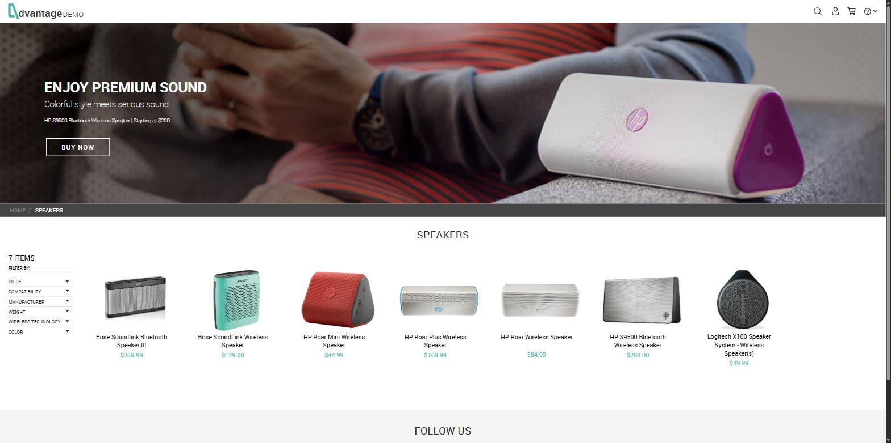 | 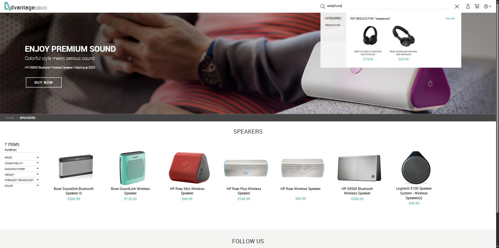 | 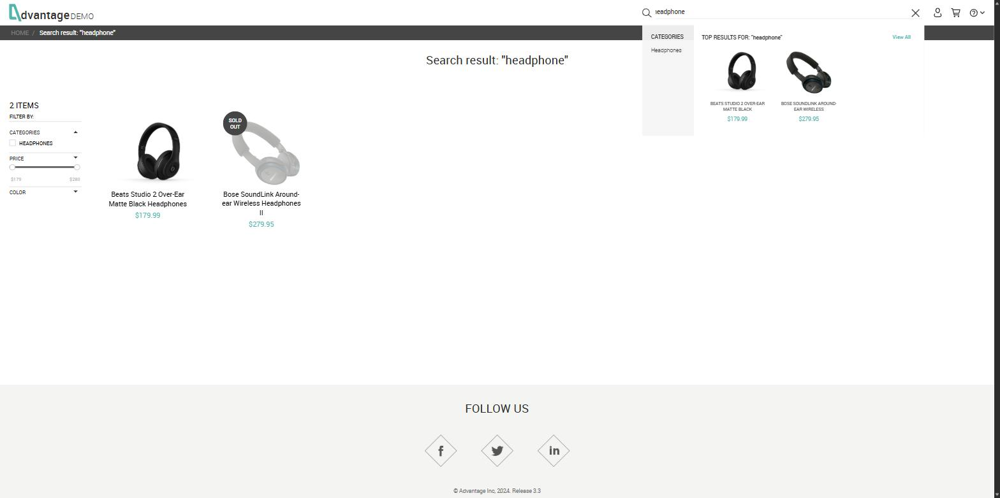 |

| ID | Requisito verificable | Actor | Datos y reglas | Resultado esperado | Prioridad |
|---|---|---|---|---|---|
| RF-06 | El sistema debe listar únicamente los productos pertenecientes a la categoría seleccionada. | Visitante / usuario | Seleccionar una categoría del home (ej. Speakers). | Se muestra la página de categoría con el conteo total de ítems (ej. "7 ITEMS") y solo productos de esa categoría, con filtros disponibles por precio, fabricante, compatibilidad, peso, tecnología inalámbrica y color. | Alta |
| RF-07 | El sistema debe devolver resultados relevantes al término buscado cuando existen productos coincidentes. | Visitante / usuario | Ingresar un término existente en el catálogo (ej. "headphone"). | Se despliega un panel de autocompletado "TOP RESULTS FOR '{término}'" con productos coincidentes y un enlace "View All" que lleva a `#/search/?viewAll={término}`, listando solo productos relacionados al término (incluye productos agotados, marcados "SOLD OUT"). | Alta |
| RF-08 | El sistema no debe mostrar productos no relacionados cuando el término buscado no tiene coincidencias en el catálogo. | Visitante / usuario | Ingresar un término inexistente en el catálogo (ej. "xyzxyznoexiste"). | No se despliega el panel de autocompletado ni se listan productos. **Riesgo detectado:** el sistema no muestra un mensaje explícito de "0 resultados encontrados"; el usuario no recibe retroalimentación de que su búsqueda no tuvo coincidencias. | Media |

---

## 5. Funcionalidad: Carrito de compras

**Dónde se encuentra:** mini-carrito desplegable (ícono superior) y `#/shoppingCart`.

| Mini-carrito: 3 × $269.99 = $809.97, sin error de redondeo (RF-09) | Página de carrito con el mismo total (RF-09/RF-11) | Carrito vacío tras REMOVE (RF-10) |
|---|---|---|
| 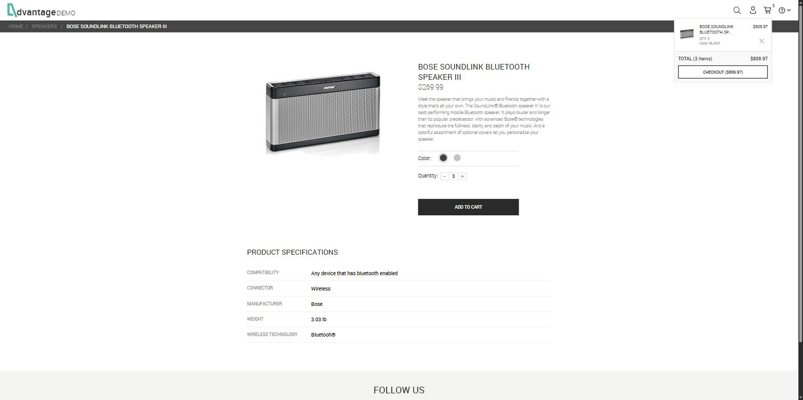 | 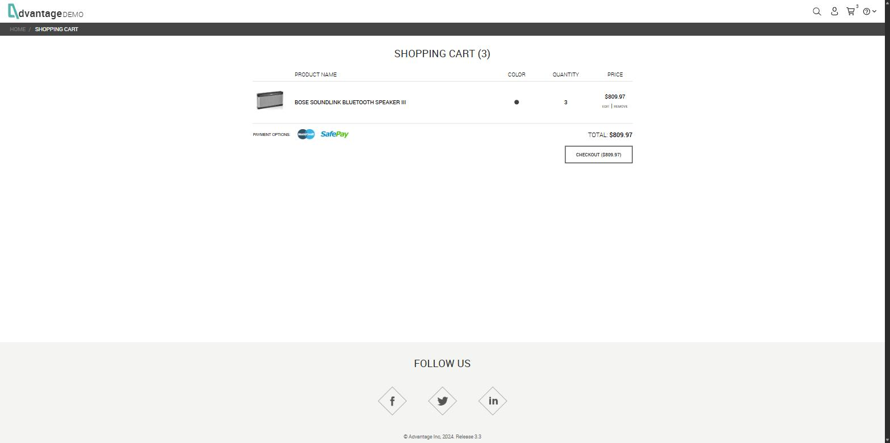 |  |

| ID | Requisito verificable | Actor | Datos y reglas | Resultado esperado | Prioridad |
|---|---|---|---|---|---|
| RF-09 | El sistema debe actualizar el contador de ítems y el subtotal correctamente al agregar un producto al carrito. | Usuario | Agregar un producto con cantidad N (probado con N=3 sobre un producto de $269.99). | El contador del carrito pasa a N y el subtotal mostrado es exactamente precio unitario × N, sin errores de redondeo (verificado: 3 × $269.99 = $809.97). | Alta |
| RF-10 | El sistema debe recalcular correctamente el carrito al quitar un producto. | Usuario | Carrito con 1 producto, usar la acción REMOVE. | El producto desaparece de la lista, el contador vuelve a 0 y se muestra el mensaje "Your shopping cart is empty". | Alta |
| RF-11 | El carrito debe mantenerse consistente si el usuario navega entre páginas del sitio sin cerrar sesión. | Usuario | Agregar un producto al carrito y navegar entre Home, categoría y ficha de producto. | El contador y el contenido del carrito no se pierden al cambiar de pantalla. | Media |

---

## 6. Funcionalidad: Checkout con dirección de envío y método de pago

**Dónde se encuentra:** `#/orderPayment` (Paso 1: Shipping details, Paso 2: Payment method).

| Checkout sin sesión → redirige a login (RF-12) | Paso 1: Shipping details (RF-15) | Paso 2: Payment method — MasterCard, PAY NOW deshabilitado (RF-13) |
|---|---|---|
| 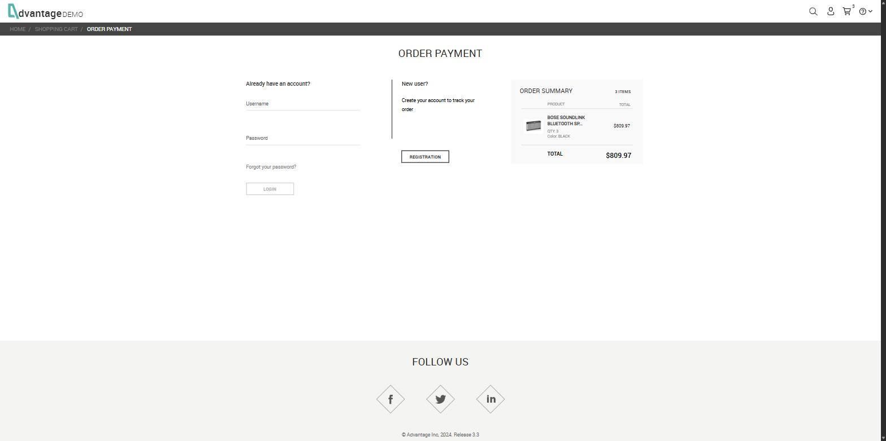 | 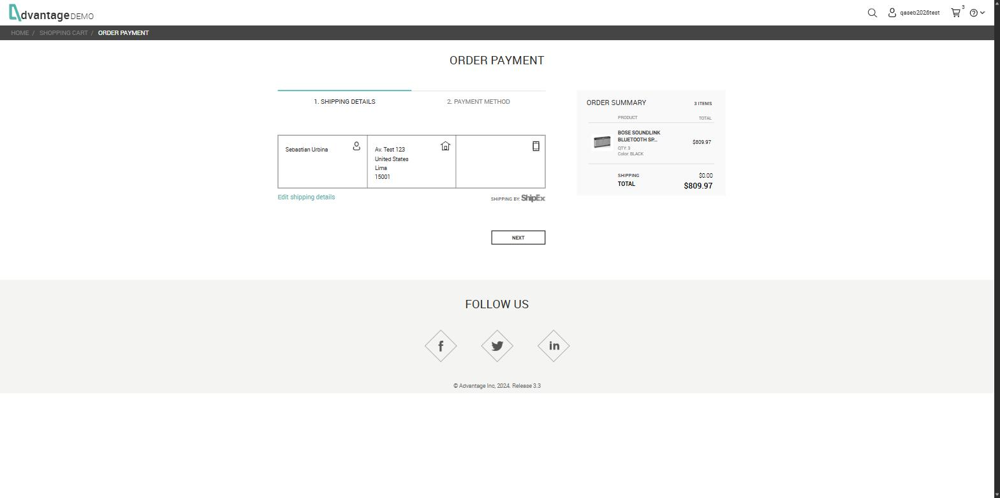 | 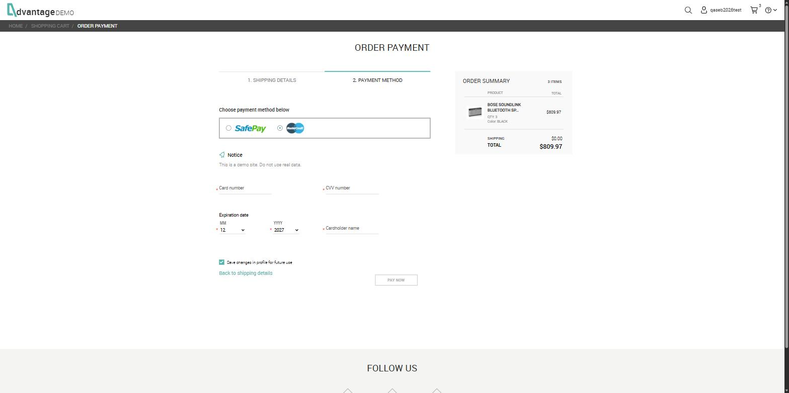 |

| ID | Requisito verificable | Actor | Datos y reglas | Resultado esperado | Prioridad |
|---|---|---|---|---|---|
| RF-12 | El sistema debe exigir una sesión iniciada antes de permitir continuar con el checkout. | Usuario sin sesión | Carrito con al menos 1 producto, click en CHECKOUT sin haber iniciado sesión. | El sistema redirige a la pantalla de login/registro (`#/login`) y no permite continuar al pago hasta autenticarse. | Alta |
| RF-13 | El sistema debe exigir todos los datos de la tarjeta al elegir MasterCard como método de pago. | Usuario autenticado | Card number, CVV number, fecha de expiración (MM/YYYY) y Cardholder name son obligatorios (marcados con asterisco). | El botón "PAY NOW" permanece deshabilitado mientras falte alguno de los 4 campos obligatorios. | Alta |
| RF-14 | El sistema debe exigir usuario y contraseña de SafePay al elegir SafePay como método de pago. | Usuario autenticado | SafePay username y SafePay password obligatorios. | El botón "PAY NOW" permanece deshabilitado mientras falte alguno de los 2 campos. | Media |
| RF-15 | El resumen de la orden debe reflejar el total correcto (productos + envío) antes de confirmar el pago. | Usuario autenticado | Carrito con productos + costo de envío mostrado por el transportista (ShipEx). | El "ORDER SUMMARY" muestra TOTAL = suma de productos + envío, sin errores de redondeo (verificado: $269.99 producto + $0.00 envío = $269.99 total). | Alta |

---

## 7. Funcionalidad: Historial de pedidos

**Dónde se encuentra:** `#/MyOrders` (menú de cuenta → "My orders").

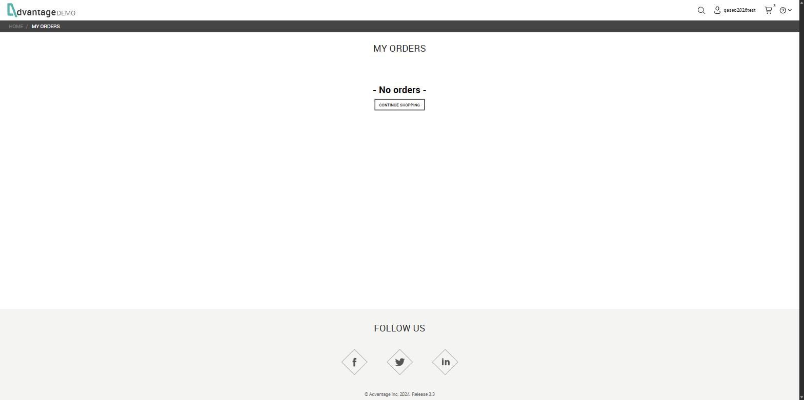

| ID | Requisito verificable | Actor | Datos y reglas | Resultado esperado | Prioridad |
|---|---|---|---|---|---|
| RF-16 | El sistema debe indicar claramente cuando el usuario no tiene pedidos registrados. | Usuario autenticado sin compras previas | Cuenta recién creada, sin pedidos confirmados. | Se muestra el mensaje "- No orders -" junto al botón "CONTINUE SHOPPING". | Media |
| RF-17 | Un pedido confirmado debe aparecer correctamente en el historial de pedidos del usuario que lo generó. | Usuario autenticado | Completar un checkout con pago aprobado. | El pedido queda listado en `#/MyOrders`, asociado a la cuenta que realizó la compra (a verificar en la fase de ejecución de pruebas). | Alta |

---

## 8. Hallazgo: Aplicación de tarjetas de regalo / promociones — no implementado

**Dónde se buscó:** carrito (`#/shoppingCart`), ambos pasos del checkout (`#/orderPayment`), y el código fuente de la aplicación (`main.min.js`).

| ID | Requisito verificable | Actor | Datos y reglas | Resultado esperado | Prioridad |
|---|---|---|---|---|---|
| RF-18 | El sistema real no ofrece ningún mecanismo de aplicación de tarjetas de regalo o códigos promocionales en el flujo de compra. | Cliente en checkout | Se revisó la página de carrito, los pasos "Shipping details" y "Payment method" del checkout, y se buscó en el bundle de código (`main.min.js`) por los términos "gift card", "giftcard" y "promo/coupon". No existe ningún campo de ingreso de código en la UI; las únicas coincidencias en el código corresponden al checkbox "Receive exclusive offers and promotions" del registro y a un parámetro sin uso de la integración de Google Analytics. | Riesgo de negocio a documentar: el caso de negocio (campaña de temporada alta) asume esta funcionalidad, pero el sistema real no la soporta. No es un defecto a probar, sino un requisito pendiente de implementación que debe reportarse antes de diseñar casos de prueba sobre él. | Alta |

---

## 9. Hallazgo: Lista de deseos (wishlist) — no implementado

**Dónde se buscó:** ficha de producto, grilla de categoría (hover sobre producto), "My Account", y el código fuente de la aplicación (`main.min.js`).

| ID | Requisito verificable | Actor | Datos y reglas | Resultado esperado | Prioridad |
|---|---|---|---|---|---|
| RF-19 | El sistema real no ofrece ninguna funcionalidad de lista de deseos (wishlist). | Usuario autenticado | Se revisó la ficha de producto, la grilla de categoría (incluyendo hover, que solo muestra "SHOP NOW"), la pantalla "My Account", y se buscó en `main.min.js` por "wishlist"/"wishList" sin ninguna coincidencia. | Riesgo de negocio a documentar: el caso de negocio asume esta funcionalidad ("agregar a wishlist no debe afectar el carrito ni generar un cargo"), pero el sistema real no la implementa. Debe reportarse como gap antes del diseño de pruebas. | Media |

---

## 10. Resumen de riesgos observados durante la exploración

- **Mensaje de error genérico e inconsistente en registro:** al fallar la validación de longitud de username, el sistema en un caso mostró el mensaje de login "Incorrect user name or password." en vez de un mensaje específico de registro — posible defecto de UX a confirmar en pruebas.
- **Sin feedback en búsquedas sin resultados:** no hay mensaje de "0 resultados" (RF-08).
- **Gap funcional respecto al caso de negocio:** wishlist y tarjetas de regalo no existen en el sistema real (RF-18, RF-19), pese a ser parte del alcance y de los riesgos iniciales del caso de negocio.
